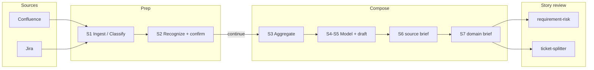

# Domain Knowledge Ops

[](https://github.com/cat2000/domain-knowledge-ops/actions/workflows/ci.yml)
[](LICENSE)
[](https://www.python.org/downloads/)

**Agent skills that teach Cursor (and other harnesses) to keep enterprise domain truth for story review** — complementing coding methodology packs like [Superpowers](https://github.com/obra/superpowers) and [Spec Kit](https://github.com/github/spec-kit).

## 60-second demo (no Atlassian)

**What you are invoking**

| Token | Meaning |
|-------|---------|
| `DEMO-1` | A **fake Jira issue key** shipped in this repo (not a live ticket). Story: buyer amends an open order while the quote is still valid. Body + brief live under [`domain-knowledge/fixtures/offline-demo/`](domain-knowledge/fixtures/offline-demo/). |
| `team=demo` | The shipped sample team in `team-roots.json` (root `100001`). Tells the agent which offline curated tree to read. |

Skills that see a `DEMO-*` key **skip Jira/network** and use that fixture instead.

```bash
git clone https://github.com/cat2000/domain-knowledge-ops.git
cd domain-knowledge-ops
# Open the **repo root** as the Cursor workspace (not a subfolder), then:
```

```text
@requirement-risk DEMO-1 team=demo
@ticket-splitter DEMO-1 team=demo
```

Expected shape of output (for comparison): [`docs/demo/`](docs/demo/).

**Next:** paths A–C → [`WALKTHROUGH.md`](WALKTHROUGH.md) · install → [`INSTALL.md`](INSTALL.md) · pack check: `python3 scripts/verify_skills_pack.py`

## How this complements other packs

| Pack | Teaches agents… | Human gate |
|------|-----------------|------------|
| Superpowers / Spec Kit / general coding skills | **How to build** software (TDD, plans, implementation) | Varies by pack |
| **Domain Knowledge Ops (this repo)** | **How to adjudicate domain truth** from Confluence + Jira, then stress-test stories | **confirm** on module cuts before Compose; **continue** after ([token glossary](TEAM_KNOWLEDGE_BASE.md#process-tokens-use-consistently)) |

Use both: build with theirs; review stories against **S7 locale briefs** from ours.

## Skills (S1–S7 pipeline)

Operational steps **S1–S7** map to narrative stages **Ingest → Recognize → Compose**. Jira adds **Classify** before shared Recognize.

| Skill | Trigger | Pipeline stage | Writes curated? |
|-------|---------|----------------|---------------|
| [`setup-domain-ops`](.cursor/skills/setup-domain-ops/SKILL.md) | `@setup-domain-ops` | Config (strategy §2, teams, profiles) | No |
| [`generate-knowledge-from-wiki`](.cursor/skills/generate-knowledge-from-wiki/SKILL.md) | `@generate-knowledge-from-wiki` + Confluence URL | **S1** Ingest → **S2** Recognize → **S3–S7** Compose (after **confirm**) | Yes |
| [`distill-domain-knowledge`](.cursor/skills/distill-domain-knowledge/SKILL.md) | `@distill-domain-knowledge` | **S2–S7** when `materialized/` already exists | Yes |
| [`add-knowledge-from-jira`](.cursor/skills/add-knowledge-from-jira/SKILL.md) | `@add-knowledge-from-jira` + team/board | Ingest → Classify → shared **S2** → **S3–S7** | Yes |
| [`requirement-risk`](.cursor/skills/requirement-risk/SKILL.md) | `@requirement-risk` + issue key | Reads **S7** `*-domain-brief.md` | No |
| [`ticket-splitter`](.cursor/skills/ticket-splitter/SKILL.md) | `@ticket-splitter` + issue key | Reads **S7** briefs; INVEST slices | No |

| Step | Name | Actor | Primary artifacts |
|------|------|-------|-------------------|
| S1 | Ingest (sync) | Script | `extracted/`, `materialized/` |
| S2 | Recognize | Agent + human **confirm** | Checklist, `_materialization_closure.json` |
| S3 | Proposition aggregate | Agent | `_aggregate/<slug>/` |
| S4–S5 | Domain model + work draft | Agent | `*-work-draft.md` |
| S6 | Source-language brief | Agent | `*-source-brief.md` |
| S7 | Locale brief | Agent | `*-domain-brief.md` (reader-facing) |

## Architecture



Contract and invariants: [`.cursor/contracts/domain-knowledge-pipeline-contract.md`](.cursor/contracts/domain-knowledge-pipeline-contract.md).

## Full pipeline quick start

```bash
cp .env.example .env   # ATLASSIAN_* and CONFLUENCE_BASE_URL
./scripts/setup.sh     # optional: venv + deps
cp domain-knowledge/jira/team-roots.example.json domain-knowledge/jira/team-roots.json
# edit team-roots.json: confluence root_id, board_id, jql_base
```

```text
@setup-domain-ops
@generate-knowledge-from-wiki https://your-site.atlassian.net/wiki/spaces/DEMO/overview?homepageId=100001
```

After **S7** briefs exist under `domain-knowledge/curated/by-root/<root_id>/_deliver/`:

```text
@requirement-risk PROJ-123
@ticket-splitter PROJ-123
```

Replace `PROJ-123` with your **real** Jira issue key (placeholder only — not a fixture).

## Configuration (not hard-coded tenants)

| File | Role |
|------|------|
| [`domain-knowledge/strategy.md`](domain-knowledge/strategy.md) | Methodology + your industry fill-in (§2) |
| [`domain-knowledge/s2-domain-profiles.json`](domain-knowledge/s2-domain-profiles.json) | Machine themes/facets (derived from strategy) |
| [`domain-knowledge/jira/team-roots.json`](domain-knowledge/jira/team-roots.json) | Teams, Confluence roots, Jira boards |
| [`.env`](.env.example) | Atlassian credentials (never commit) |

Ships with one demo team (`demo`) and offline fixtures (`offline-demo`, `saas-billing`). Add keys under `teams{}` for more product lines.

## Generated data (not shipped)

`domain-knowledge/curated/`, `extracted/`, and `materialized/` under `by-root/` are **local pipeline outputs** (gitignored). Fixtures under `fixtures/offline-demo/` and `fixtures/saas-billing/` ship on purpose.

## Docs

| Doc | Purpose |
|-----|---------|
| [`WALKTHROUGH.md`](WALKTHROUGH.md) | Paths A–C (+ B2 billing): offline → industry map → real wiki |
| [`INSTALL.md`](INSTALL.md) | Cursor, `npx skills`, multi-harness |
| [`CONTRIBUTING.md`](CONTRIBUTING.md) | Tests, PRs, language SSOT |
| [`SECURITY.md`](SECURITY.md) | Reporting vulnerabilities |
| [`CHANGELOG.md`](CHANGELOG.md) | Release notes |
| [`docs/METHODOLOGY.md`](docs/METHODOLOGY.md) | **Confirm-gated Compose** — goals, module cutting, quality bar |
| [`docs/BENCHMARK.md`](docs/BENCHMARK.md) | Story review with vs without an S7 brief |
| [`docs/HARNESS.md`](docs/HARNESS.md) | Cursor / Claude Code / Codex notes |
| [`docs/MARKETPLACE.md`](docs/MARKETPLACE.md) | Pre-publish distribution checklist |
| [`docs/demo/`](docs/demo/) | Sample risk and split outputs |

Skill index (locales): [`.cursor/skills/README.md`](.cursor/skills/README.md).

## Maintainers

See [CONTRIBUTING.md](CONTRIBUTING.md).

## License

MIT — see [LICENSE](LICENSE).
