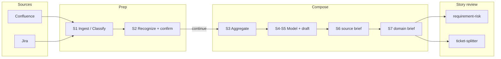

# Domain Knowledge Ops

[](https://github.com/cat2000/domain-knowledge-ops/actions/workflows/ci.yml)
[](LICENSE)
[](https://www.python.org/downloads/)

**Stop reviewing Jira stories against vibes.**

Agent skills that turn Confluence + Jira into domain briefs, then run story risk and INVEST splits against that shared truth.

| Without a domain brief | With this pack |
|------------------------|----------------|
| Open decisions become silent assumptions | MUST / SHOULD / OPTIONAL from ticket + brief evidence |
| Agents invent out-of-scope work | Boundaries stay out |
| “Done” = code merged / ready for QA | Done = observable user, system, or contract outcome |
| Every story invents its own vocabulary | Same module language across risk and split |

Complements [Superpowers](https://github.com/obra/superpowers) / [Spec Kit](https://github.com/github/spec-kit) (how to build). This pack: what the domain allows.  
Before/after: [docs/BENCHMARK.md](docs/BENCHMARK.md).

## Try it in 60 seconds

No Atlassian. Open this repo root in Cursor:

```bash
git clone https://github.com/cat2000/domain-knowledge-ops.git
cd domain-knowledge-ops
```

```text
@requirement-risk DEMO-1 team=demo
@ticket-splitter DEMO-1 team=demo
```

DEMO-1 is a shipped fake ticket (amend open order while quote is valid). team=demo uses the offline curated tree. Any DEMO-* key skips the network.

Expected shape:

```text
Scope: amend line qty on Open orders while quote is valid;
       expired quote disables save; shipped lines stay read-only.

MUST FIX
  R-001  Quantity-up may need seller approval — still open
  R-002  Partially Shipped amend approval — unresolved

Readiness: Ready with risks

→ Spike: confirm approval matrix
→ Story: change qty on Open + valid quote
→ Story: block save when quote expired
→ Story: shipped lines read-only on partial ship
```

Next steps:

- [WALKTHROUGH.md](WALKTHROUGH.md) — paths A–C
- [INSTALL.md](INSTALL.md) — clone only
- [docs/demo/](docs/demo/) — full sample outputs
- Second industry: `@requirement-risk DEMO-BILL-1 team=demo`

## Story review

### Requirement risk

Goal: in ~30s know whether to commit and what to decide first.

Invoke: `@requirement-risk` + issue key (or DEMO-1).

| Severity | Means |
|----------|--------|
| MUST FIX | Wrong build, sprint rework, blocker, or serious security/compliance risk |
| SHOULD CLARIFY | May ship; likely debate or acceptance pain |
| OPTIONAL | Nice to tighten; not a commit blocker |

Each finding: evidence → stakes → disposition. Ticket vs brief conflicts listed side by side.  
Details: [requirement-risk skill](.cursor/skills/requirement-risk/SKILL.md)

### Ticket splitter

Goal: split by shipped outcomes (scope + observable done_when), not FE/BE or “dev vs QA”.

Invoke: `@ticket-splitter` + issue key (or DEMO-1).

| Surface | Done looks like… |
|---------|------------------|
| User | Visible behavior, copy, scenario |
| System | Safe state / migration / runnable intermediate |
| Contract | API, schema, event, boundary |

Spike (uncertainty) → Stories (shippable) → optional Enabler.  
Details: [ticket-splitter skill](.cursor/skills/ticket-splitter/SKILL.md)

## Build briefs

| You need… | Invoke | You get |
|-----------|--------|---------|
| Name your product cut | `@setup-domain-ops` | Strategy §2 + profiles |
| Wiki → reader briefs | `@generate-knowledge-from-wiki` + URL | confirm → continue → S7 under `_deliver/` |
| Jira as rule evidence | `@add-knowledge-from-jira` | Same Compose path |
| Re-compose, no re-sync | `@distill-domain-knowledge` | Advanced when materialized/ already exists |

Design bets: confirm-gated Compose · briefs as evidence · scripts gate form · offline-first — [methodology](docs/METHODOLOGY.md).

## How it works



S1–S7 = Ingest → Recognize → Compose. Reader-facing output is the S7 domain brief (`*-domain-brief.md`).

- [Pipeline contract](.cursor/contracts/domain-knowledge-pipeline-contract.md)
- [Skills index](.cursor/skills/README.md)
- Process tokens (confirm / continue / brief): [TEAM_KNOWLEDGE_BASE.md](TEAM_KNOWLEDGE_BASE.md#process-tokens-use-consistently)

## Use on your tenant

See [WALKTHROUGH Path C](WALKTHROUGH.md).

```bash
cp .env.example .env   # ATLASSIAN_* and CONFLUENCE_BASE_URL
./scripts/setup.sh     # optional: venv + deps
cp domain-knowledge/jira/team-roots.example.json domain-knowledge/jira/team-roots.json
# edit v3: libraries.<key>.root_id + confluence_overview; teams.<key>.jira.board_id + libraries: [<key>]
```

```text
@setup-domain-ops
@generate-knowledge-from-wiki https://your-site.atlassian.net/wiki/spaces/DEMO/overview?homepageId=100001
```

Mark checklist rows confirm, then say continue. Then:

```text
@requirement-risk PROJ-123 team=<your_team>
@ticket-splitter PROJ-123
```

## Configuration

| File | Role |
|------|------|
| [domain-knowledge/strategy.md](domain-knowledge/strategy.md) | Methodology + industry fill-in (§2) |
| [domain-knowledge/s2-domain-profiles.json](domain-knowledge/s2-domain-profiles.json) | Themes/facets from strategy |
| [domain-knowledge/jira/team-roots.json](domain-knowledge/jira/team-roots.json) | v3: libraries (spaces) + teams (boards + mounts) |
| [.env](.env.example) | Atlassian credentials (never commit) |

Pipeline outputs under by-root (`curated/`, `extracted/`, `materialized/`) are local and gitignored. Fixture trees under `fixtures/` ship on purpose.

## Docs

| Doc | Purpose |
|-----|---------|
| [WALKTHROUGH.md](WALKTHROUGH.md) | Paths A–C: demo → with/without brief → real wiki |
| [INSTALL.md](INSTALL.md) | Clone (only supported install) |
| [docs/METHODOLOGY.md](docs/METHODOLOGY.md) | Confirm-gated Compose |
| [docs/TEAM_ROOTS_V3.md](docs/TEAM_ROOTS_V3.md) | Draft: one space = one library; teams mount many |
| [docs/demo/](docs/demo/) | Sample risk and split outputs |

Also: [HARNESS](docs/HARNESS.md) · [CONTRIBUTING](CONTRIBUTING.md) · [CHANGELOG](CHANGELOG.md) · [SECURITY](SECURITY.md) · [MARKETPLACE](docs/MARKETPLACE.md) · [skills README](.cursor/skills/README.md)

## License

MIT — see [LICENSE](LICENSE).
