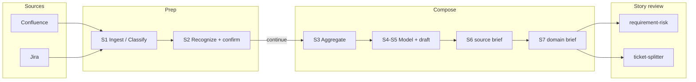

# Domain Knowledge Ops

[](https://github.com/cat2000/domain-knowledge-ops/actions/workflows/ci.yml)
[](LICENSE)
[](https://www.python.org/downloads/)

**Stop reviewing Jira stories against vibes.**

Cursor (and other) agent skills that turn Confluence + Jira into **adjudicated domain briefs**, then run story risk and INVEST splits against that shared truth — not against whatever the model invents this turn.

Coding packs like [Superpowers](https://github.com/obra/superpowers) and [Spec Kit](https://github.com/github/spec-kit) teach agents **how to build**. This pack teaches them **what the domain allows**.

| Without a domain brief | With this pack |
|------------------------|----------------|
| Open decisions become silent assumptions | **MUST** / **SHOULD** / **OPTIONAL** from ticket + brief evidence |
| Agents invent out-of-scope work | Boundaries stay out |
| “Done” = code merged / ready for QA | **Done** = observable user, system, or contract outcome |
| Every story invents its own vocabulary | Same module language across risk and split |

Before/after on the same fixture: [`docs/BENCHMARK.md`](docs/BENCHMARK.md).

## Try it in 60 seconds

No Atlassian account. Open this **repo root** as the Cursor workspace:

```bash
git clone https://github.com/cat2000/domain-knowledge-ops.git
cd domain-knowledge-ops
```

```text
@requirement-risk DEMO-1 team=demo
@ticket-splitter DEMO-1 team=demo
```

`DEMO-1` is a shipped **fake** ticket (buyer amends an open order while the quote is valid). `team=demo` selects the offline curated tree. Any `DEMO-*` key skips Jira and the network.

Expected shape (abbreviated from [`docs/demo/`](docs/demo/)):

```text
Scope: amend line qty on Open orders while quote is valid;
       expired quote disables save; shipped lines stay read-only.

MUST FIX
  R-001  Quantity-up may need seller approval — still open in ticket + brief
  R-002  Partially Shipped amend approval — unresolved boundary

Readiness: Ready with risks

→ Spike: confirm approval matrix
→ Story: purchaser changes qty on Open + valid quote
→ Story: block save when quote expired
→ Story: shipped lines read-only on partial ship
```

Full samples: [requirement-risk](docs/demo/requirement-risk-DEMO-1.sample.md) · [ticket-splitter](docs/demo/ticket-splitter-DEMO-1.sample.md)  
Second industry: `@requirement-risk DEMO-BILL-1 team=demo`

Walkthrough (paths A–C) · [WALKTHROUGH.md](WALKTHROUGH.md) · Install · [INSTALL.md](INSTALL.md) · Pack check: `python3 scripts/verify_skills_pack.py`

## Story review — what “good” means

### `@requirement-risk` — fewer wrong builds after the sprint starts

Optimize **decision latency**: in ~30s the room knows whether to commit, and **what must be decided first** — not a long risk essay.

| Severity | Means |
|----------|--------|
| **MUST FIX** | High chance of wrong build, **sprint rework**, or blocker — or serious security/compliance risk |
| **SHOULD CLARIFY** | May ship, but likely debate, inconsistency, or acceptance pain |
| **OPTIONAL** | Nice to tighten; not a commit blocker |

Each finding is **evidence → stakes** (who hurts, how, when) **→ disposition**. Ticket vs domain-brief conflicts are listed **side by side**, never silently resolved. Readiness is one line: Ready / Ready with risks / Not enough to commit.

### `@ticket-splitter` — split by verifiable outcome, not by role or layer

Done means observable in **shipped** terms — not “dev done / ready for QA.” Scripts reject fake testability.

Pick **one primary verification surface**, then cut by smallest complete result:

| Surface | Done looks like… |
|---------|------------------|
| **User** | Visible behavior, copy, scenario outcome |
| **System** | Safe state transition, migration/compat, runnable intermediate |
| **Contract** | API / schema / event / boundary correctness |

Shape: **Spike** for material uncertainty → **Stories** for shippable outcomes → optional **Enabler** only when integration truly blocks. Not the split axis: FE vs BE, “dev ticket vs QA ticket,” or folder/task checklists.

Skills: [requirement-risk](.cursor/skills/requirement-risk/SKILL.md) · [ticket-splitter](.cursor/skills/ticket-splitter/SKILL.md)

## Build domain briefs

| You need… | Invoke | You get |
|-----------|--------|---------|
| Name your product cut | `@setup-domain-ops` | Strategy §2 + derived profiles |
| Wiki → reader briefs | `@generate-knowledge-from-wiki` + Confluence URL | Checklist → human **confirm** → **continue** → S7 briefs under `_deliver/` |
| Jira as business-rule evidence | `@add-knowledge-from-jira` + team/board | Same Compose path; tickets are not a post-hoc appendix |
| Re-compose without re-sync | `@distill-domain-knowledge` | Advanced when `materialized/` already exists (default resume is **continue**) |

**Design bets**

- **Confirm-gated Compose** — humans own module boundaries before briefs are written ([methodology](docs/METHODOLOGY.md))
- **Briefs are evidence, not prompts** — risk/split *read* S7 reader briefs; they do not rewrite curated truth
- **Scripts gate form** — structure and fake testability fail closed; semantics stay human-owned
- **Offline-first** — fixtures prove the loop before credentials

## How it works



**S1–S7** = Ingest → Recognize → Compose. Jira adds **Classify** before shared Recognize. Reader-facing deliverable is the **S7** `*-domain-brief.md`.

| Step | Name | Actor | Primary artifacts |
|------|------|-------|-------------------|
| S1 | Ingest | Script | `extracted/`, `materialized/` |
| S2 | Recognize | Agent + human **confirm** | Checklist, closure index |
| S3 | Aggregate | Agent | `_aggregate/<slug>/` |
| S4–S5 | Model + draft | Agent | `*-work-draft.md` |
| S6 | Source-language brief | Agent | `*-source-brief.md` |
| S7 | Locale / reader brief | Agent | `*-domain-brief.md` |

| Skill | Writes curated? |
|-------|-----------------|
| [setup-domain-ops](.cursor/skills/setup-domain-ops/SKILL.md) | No |
| [generate-knowledge-from-wiki](.cursor/skills/generate-knowledge-from-wiki/SKILL.md) | Yes |
| [distill-domain-knowledge](.cursor/skills/distill-domain-knowledge/SKILL.md) | Yes |
| [add-knowledge-from-jira](.cursor/skills/add-knowledge-from-jira/SKILL.md) | Yes |
| [requirement-risk](.cursor/skills/requirement-risk/SKILL.md) | No |
| [ticket-splitter](.cursor/skills/ticket-splitter/SKILL.md) | No |

Contract: [domain-knowledge-pipeline-contract.md](.cursor/contracts/domain-knowledge-pipeline-contract.md) · Process tokens (**confirm** / **continue** / **brief**): [TEAM_KNOWLEDGE_BASE.md](TEAM_KNOWLEDGE_BASE.md#process-tokens-use-consistently)

## Use on your tenant

User steps: [WALKTHROUGH.md](WALKTHROUGH.md) **Path C**.

```bash
cp .env.example .env   # ATLASSIAN_* and CONFLUENCE_BASE_URL
./scripts/setup.sh     # optional: venv + deps
cp domain-knowledge/jira/team-roots.example.json domain-knowledge/jira/team-roots.json
# edit: confluence root_id, board_id, jql_base
```

```text
@setup-domain-ops
@generate-knowledge-from-wiki https://your-site.atlassian.net/wiki/spaces/DEMO/overview?homepageId=100001
```

Mark checklist rows **confirm**, then say **continue**. When S7 briefs exist under `domain-knowledge/curated/by-root/<root_id>/_deliver/`:

```text
@requirement-risk PROJ-123
@ticket-splitter PROJ-123
```

Replace `PROJ-123` with a real Jira key.

## Configuration

| File | Role |
|------|------|
| [domain-knowledge/strategy.md](domain-knowledge/strategy.md) | Methodology + industry fill-in (§2) |
| [domain-knowledge/s2-domain-profiles.json](domain-knowledge/s2-domain-profiles.json) | Themes/facets derived from strategy |
| [domain-knowledge/jira/team-roots.json](domain-knowledge/jira/team-roots.json) | Teams, Confluence roots, Jira boards |
| [.env](.env.example) | Atlassian credentials (never commit) |

Ships with team `demo` and fixtures `offline-demo`, `saas-billing`. Add more product lines under `teams{}`.

`domain-knowledge/curated/`, `extracted/`, and `materialized/` under `by-root/` are **local outputs** (gitignored). Fixture trees under `fixtures/` ship on purpose.

## Docs

| Doc | Purpose |
|-----|---------|
| [WALKTHROUGH.md](WALKTHROUGH.md) | Paths A–C (+ B2 billing): offline → industry map → real wiki |
| [INSTALL.md](INSTALL.md) | Cursor, `npx skills`, multi-harness |
| [docs/METHODOLOGY.md](docs/METHODOLOGY.md) | Confirm-gated Compose, module cutting, quality bar |
| [docs/BENCHMARK.md](docs/BENCHMARK.md) | Story review with vs without an S7 brief |
| [docs/demo/](docs/demo/) | Sample risk and split outputs |
| [docs/HARNESS.md](docs/HARNESS.md) | Cursor / Claude Code / Codex |
| [CONTRIBUTING.md](CONTRIBUTING.md) | Tests, PRs, language SSOT |
| [CHANGELOG.md](CHANGELOG.md) | Release notes |
| [SECURITY.md](SECURITY.md) | Vulnerability reporting |
| [docs/MARKETPLACE.md](docs/MARKETPLACE.md) | Pre-publish distribution checklist |

Skill index (locales): [.cursor/skills/README.md](.cursor/skills/README.md)

## License

MIT — see [LICENSE](LICENSE).
