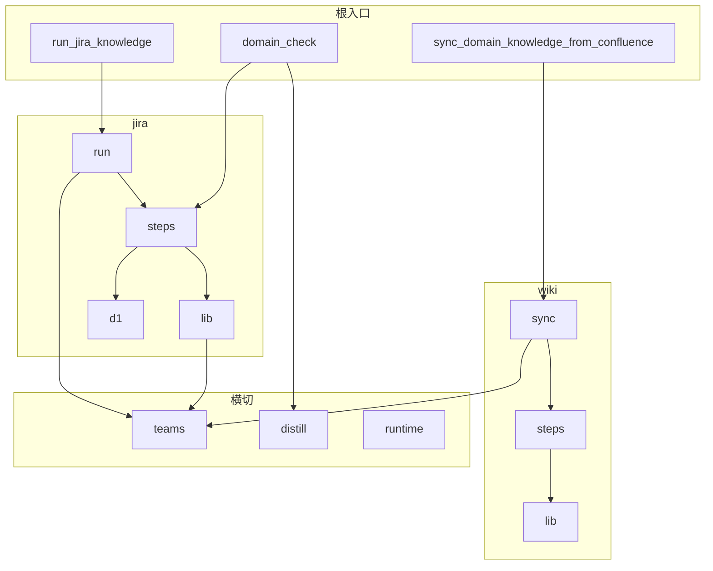

# scripts · 结构统筹（SSOT）

三条流水线 **Wiki 同步 → 蒸馏（Cursor）→ Jira 补充**，脚本按 **流水线 × 角色** 分包，不按团队拆顶层目录。Confluence 发布由人手动完成，不保留发布脚本。

## 分层原则

| 层 | 放什么 | 不放什么 |
|----|--------|----------|
| **根目录 `*.py`** | 稳定 **CLI 入口**、跨流水线门面（`domain_check`）、`_bootstrap.py` | 业务实现 |
| **`<pipeline>/steps/`** | 该流水线子步骤（可被子进程调用） | 跨流水线逻辑 |
| **`<pipeline>/lib/`** | 该流水线共享库 | 编排 |
| **`<pipeline>/sync` 或 `run.py`** | 主编排 | |
| **`runtime/`** | `sys.path` 引导与 `REPO_ROOT` / `SCRIPTS_DIR` | 业务 |
| **`teams/`** | `team-roots.json` 的代码映射 | Jira/Wiki 实现 |
| **`distill/`** | 蒸馏 **门禁**（无 LLM） | |

**团队维度**只出现在 `domain-knowledge/jira/team-roots.json`（及 `scripts/teams/registry.py` 读取层）。

## 模块命名（thin CLI + 四层拆分）

编排类脚本按职责拆文件名后缀，**不把 HTTP / 纯逻辑 / 编排混在一个大文件里**：

| 后缀 | 职责 | 可单测 | 示例 |
|------|------|--------|------|
| **`*_types.py`** | `dataclass` 配置与路径 | — | 管线：`SyncConfig`（`wiki/sync`）、`JiraSyncConfig`（`jira/`）；子步骤：`FetchConfig`（`jira/steps`） |
| **`*_run.py`** | 幂等步骤编排（`run_*` → `step_*`） | 集成 / mock I/O | 管线：`pipeline_run`（`wiki/sync`）；子步骤：`steps/fetch_run`、`steps/extract_run` |
| **`*_logic.py`** | 纯函数（JQL 合并、inventory merge、ADF 解析） | **是** | `pipeline_logic.py`、`jira_fetch_logic.py`、`extract_logic.py` |
| **`*_http.py`** | REST 调用与响应规范化 | mock `urllib` | `jira_fetch_http.py`、`extract_http.py` |
| **`steps/*.py`** | **薄 CLI**：`argparse` + `main()` → 立刻委托 `*_run` | — | `fetch.py`、`extract.py`、`enumerate.py` |

新增大步骤时优先 **TDD 先写 `*_logic` 单测**，再补 HTTP / 编排；不要先在 `steps/*.py` 里堆业务。

### `*_run` / `*_types` 放哪（Wiki 与 Jira 统一）

| 层级 | 目录 | 放什么 |
|------|------|--------|
| **管线编排** | `wiki/sync/`、`jira/` 包根 | `pipeline_run` / `run_pipeline` + 管线级 `*_types`（`SyncConfig`、`JiraSyncConfig`） |
| **子步骤** | `wiki/steps/`、`jira/steps/` | 薄 CLI + 该步的 `*_run.py` + `*_types.py`（如 `fetch_run`、`extract_run`、`enumerate_run`） |

**禁止**把子步骤的 `fetch_run.py`、`attribute_run.py` 等放在 `jira/` 包根；**禁止**把 `extract_run` 放在 `wiki/sync/`。契约见 `tests/test_steps_layout.py`。

## 编排约定（幂等步骤）

主编排（`run_s1_sync`、`run_fetch`、`run_jira_sync`）里的每个 **`step_*` 应可单独重跑**：

- 输入：上游已落盘的 artifact（JSON / `pages/*.md`）
- 行为：按当前输入 **覆盖** 本步输出（merge-by-id 等逻辑放在 `*_logic`）
- 不在 step 内藏「仅首次有效」的副作用；游标 / 状态写入集中在明确的一步（如 Jira `sync-state.json`）

这样 pipeline 与子步骤子进程调用都保持 **declarative**：读配置对象 → 按名执行步骤表。

## `runtime/` 横切内核

| 模块 | 用途 |
|------|------|
| `paths.py` / `domain_knowledge_paths.py` | `REPO_ROOT`、`domain-knowledge` 布局常量 |
| `classify_keywords.py` | 标题/正文关键词匹配（`jira` 与 `wiki` 共用，**禁止** `jira` → `wiki.lib`） |
| `atlassian_env.py` | `load_dotenv`、`ConfluenceEnv` / `JiraEnv`、Basic Auth |

**何时放进 `runtime/`**：两个及以上流水线要用、且不含 Wiki/Jira 业务语义。  
**何时不放**：JQL 拼装、facet 归类、handoff 文案 → 留在对应 `wiki/` / `jira/`。

## 设计原则（书评落地）

以下摘自 *Clean Code* / *Clean Architecture* / *Implementation Patterns* 等，写成可执行的仓库约定（非逐书笔记）。

Beck *Implementation Patterns* §3.2 六原则与本表对应：**命名**见下文「命名约定」；其余五条见本表。

| 原则 | 在本仓库的体现 |
|------|----------------|
| **依赖规则**（Clean Architecture） | `wiki` ↔ `jira` 不互引；`distill` 只读盘 |
| **Stepdown**（Clean Code） | 见下文「文件内函数顺序」 |
| **Composed Method**（Beck §3.2） | `run_*` 读起来像步骤列表；单步细节在 `step_*` / `*_logic` |
| **Logic and Data Together**（Beck §3.2） | 配置与路径进 `*_types`（`SyncConfig`、`SyncPaths`、`FetchConfig`），与消费它的 `*_run` 同包；`teams/registry.py` 与 `team-roots.json` 同域；`atlassian_env.ConfluenceEnv` / `JiraEnv` 把凭据与请求头生成放在一起——**不要**把「解释 JSON 字段」的逻辑甩到远处工具模块 |
| **Symmetry**（Beck §3.2） | Wiki S1 与 Jira 管线同形：薄 `steps/*.py` → `*_run` → `step_*` → `*_logic` / `*_http`；`extract.py` 与 `fetch.py` 对称；子步骤均可 `python3 …/steps/<x>.py -h` 单独调用 |
| **Local Consequences**（Beck） | 改 Jira 拉票只动 `jira/`；改 Wiki 同步只动 `wiki/`；改蒸馏门禁只动 `distill/` |
| **Minimize Repetition**（Beck） | `.env` / Auth / 关键词 SSOT 在 `runtime/`；禁止每文件复制 `_load_dotenv` |
| **Declarative Expression**（Beck §3.2） | 配置进 `*_types`；管线是具名 `step_*`，不是匿名回调链 |
| **Rate of Change**（Beck §3.2） | `*_logic` 随业务常变且可测；`*_http` 随 API 变；`*_run` 随步骤顺序变 |

不必在 PR 里引用书名；按上表自检即可。

## 目录树

```
scripts/
├── ARCHITECTURE.md
├── README.md
├── _bootstrap.py              → runtime（子进程 path）
├── _install.py                → 任意深度模块统一 bootstrap
│
├── sync_domain_knowledge_from_confluence.py   → wiki.sync.pipeline
├── run_jira_knowledge.py             → jira.run
├── run_jira_ingest.py                → jira.ingest_run (fetch 默认；--materialize 可选物化)
├── domain_check.py                       → distill/*.py + jira/steps/check_pipeline.py
├── run_distill_gate.py               → distill.gate (S2/S6 一致性 + distill 门禁 + glossary 更新)
├── runtime/                 paths · bootstrap · classify_keywords · atlassian_env
├── wiki/
│   ├── sync/   pipeline.py · pipeline_run.py · pipeline_logic.py · pipeline_types.py
│   ├── steps/  enumerate.py · enumerate_run.py · extract.py · extract_run.py · …
│   ├── lib/    enumerate_logic.py · enumerate_http.py · extract_logic.py · extract_http.py · …
│   ├── confluence_attachment_handler_map.example.json   → 复制为同目录 `.json` 覆盖扩展名处理器
├── jira/
│   ├── run.py · run_pipeline.py · run_types.py
│   ├── steps/  fetch.py · fetch_run.py · fetch_types.py · attribute.py · attribute_run.py · …
│   ├── lib/
├── distill/
│   ├── coverage.py · proposition_extract.py · proposition_quality.py · domain_model_quality.py · s5_work_draft_quality.py · quality.py · domain_layout.py · s6_reader_quality.py · glossary_update.py · gate.py
├── teams/
│   ├── registry.py
```

## 依赖方向（禁止反向）



- `teams` **不** import `jira.run` / `wiki.sync`
- `distill` **不** import `wiki` / `jira`（仅读 `domain-knowledge/` 盘）
- `wiki.lib` **不** import `jira`

## 新增代码放哪

| 要做的事 | 位置 |
|----------|------|
| Confluence 枚举/抽取/物化 | `wiki/steps/` 或 `wiki/lib/` |
| **可单测的抽取/附件/Jira/S1 编排** | `wiki/lib/*_logic.py`、`wiki/lib/extract_http.py`、`wiki/sync/pipeline_logic.py`、`jira/lib/jira_fetch_logic.py`、`jira/lib/jira_fetch_http.py`（step 只做 CLI + I/O） |
| 粘贴 URL 解析、reuse by-root | `wiki/sync/` |
| Jira 拉票/归因/摘录门禁 | `jira/steps/` 或 `jira/lib/` |
| 定稿路径、团队配置 | `teams/registry.py` |
| 蒸馏闭环/质量/排版检查 | `distill/` |
| 附件扩展名 → 处理器覆盖 | `wiki/confluence_attachment_handler_map.json`（由 `.example.json` 复制） |

## 导入约定

- 业务代码：`from wiki.lib…`、`from jira.lib…`、`from teams.registry import …`
- 跨流水线共享内核（关键词匹配、Atlassian 凭据）：`from runtime.classify_keywords import …`、`from runtime.atlassian_env import …` — **禁止** `jira` import `wiki.lib`
- 子步骤 CLI：`python3 scripts/<pipeline>/steps/<module>.py`
- 历史一次性搬迁脚本不保留；需要重做迁移时按当前命名和布局重新写临时脚本，完成后删除。

### `sys.path` 引导（`_install.py`）

任意深度的模块在首段 import 之后、业务 import 之前加入：

```python
_SCRIPTS = next(p for p in Path(__file__).resolve().parents if (p / "_install.py").is_file())
if str(_SCRIPTS) not in sys.path:
    sys.path.insert(0, str(_SCRIPTS))
import _install

_install.bootstrap(__file__)
```

实现见 `scripts/_install.py`（定位 `scripts/` 并 `import _bootstrap`）。**不要**再手写 `parents[1]` / `parents[2]` 或散落 `import _bootstrap`。

### 文件内函数顺序（Stepdown Rule）

源自 *Clean Code*：**调用者在上，被调用者在下**；同一抽象层（如 `step_*`）保持连续。

| 文件类型 | 顺序 |
|----------|------|
| **`*_run.py` / 编排** | 入口 `run_*` → 按管线顺序的 `step_*` → 各 step 的私有 helper → 叶子工具（`_log` 等） |
| **`*_logic.py`** | 公开 API → 仅被下方调用的 helper |
| **CLI `steps/*.py`** | `main()`（解析 args 后立刻调 `run_*`）→ 编排函数 → 逐层下降的 helper |

反模式：helpers 堆在文件头、`run_s1_sync` 沉在文件尾、`print_*` 插在两个 `step_*` 之间。

## 契约测试

布局与 **import 禁令** 的 SSOT 在 [`tests/domain_knowledge_contracts.py`](../tests/domain_knowledge_contracts.py)（先改常量 + 测试，再改产品代码）。

| 契约 | 测试 |
|------|------|
| `jira/` 不 import `wiki.lib` / `wiki.sync` | `test_jira_package_does_not_import_wiki` |
| 纯逻辑模块 | `tests/test_*_logic.py`（无 HTTP） |
| CLI / 包入口可导入 | `tests/test_refactor_regression.py` |
| 命名约定（`REPO_ROOT`、`parser`、`write_json` 等） | `tests/test_naming_conventions.py` |
| 子步骤 `*_run` 须在 `steps/` | `tests/test_steps_layout.py` |

### 命名约定（Beck §3.2 · Intention-Revealing Names）

| 概念 | 统一名称 | SSOT |
|------|----------|------|
| 仓库根目录 | `REPO_ROOT` | `runtime/paths.py`（`wiki.sync.env` 再导出） |
| CLI 参数解析器 | `parser` | — |
| 写 JSON 文件 | `write_json` | `jira/lib/jira_fetch_logic.py` |
| 页附件抽取 | `extract_page_attachments` | `wiki/lib/confluence_attachment_extract.py` |
| Confluence 枚举 | `enumerate_to_compact` | `wiki/steps/enumerate_run.py` + `wiki/lib/enumerate_logic.py` |
| 物化 rules | `materialize_dirs` | `wiki/steps/materialize_run.py` + `wiki/lib/materialize_logic.py` |
| Jira Ingest 拉票（默认）+ 可选物化 | `run_jira_ingest` | `jira/ingest_run.py` + `steps/fetch_run` + `steps/materialize_run` |
| Jira Classify 归因 | `run_attribute` | `jira/steps/attribute_run.py` + `jira/lib/attribute_logic.py` |
| Jira pipeline 检查 | `run_check_pipeline` | `jira/steps/check_pipeline_run.py` + `jira/lib/pipeline_check_logic.py` |
| Jira Classify 通读扫描 | `run_read_business` | `jira/steps/read_business_run.py` + `jira/lib/read_business_logic.py` |
| Jira Ingest 物化 | `run_jira_materialize` | `jira/steps/materialize_run.py` + `jira/lib/jira_materialize_logic.py` |
| Jira Sprint 队列 | `refresh_sprints_cli` | `jira/lib/jira_sprints_logic.py` + `jira/lib/jira_sprints_http.py` |
| Jira 门禁门面 | `domain_check jira` | `domain_check.py` → `check_pipeline_run` |
| 来源页索引 | `run_source_coverage` | `wiki/steps/source_coverage_run.py` + `wiki/lib/source_coverage_logic.py` |
| 归因 YAML 解析 | `parse_attribution_yaml` | `jira/lib/attribution_yaml.py` |

禁止：`REPO`/`ROOT` 别名、`ap`、`save_json`、`get_page_v2`、`process_page_attachments`；见 `domain_knowledge_contracts.FORBIDDEN_*`。

新增横切内核或依赖规则时，**同步**更新 `domain_knowledge_contracts.py` 与对应测试。

## 测试

```bash
python3 -m unittest discover -s tests -p 'test_*.py' -v
```

见 [`tests/README.md`](../tests/README.md)。
